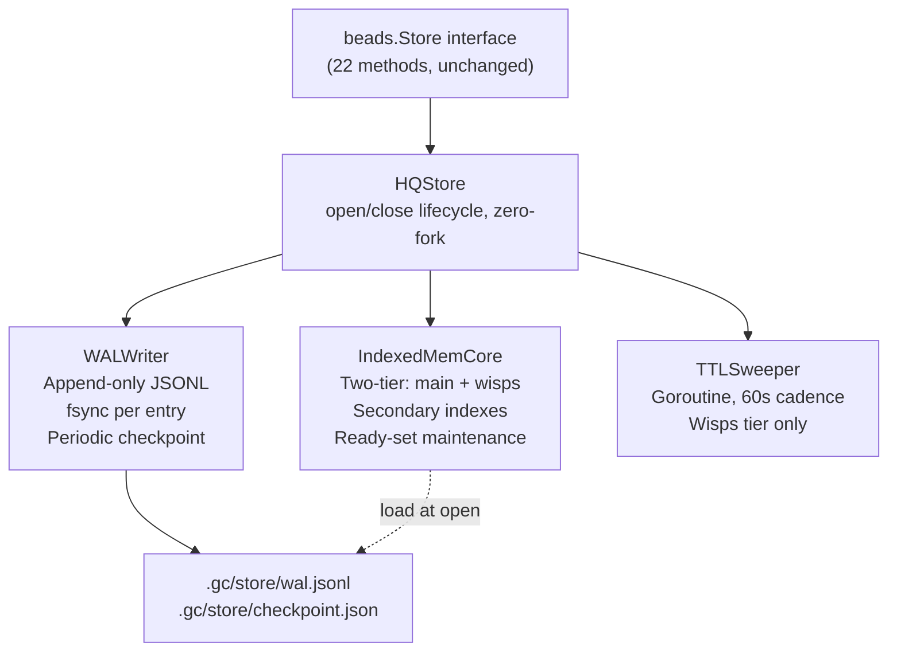
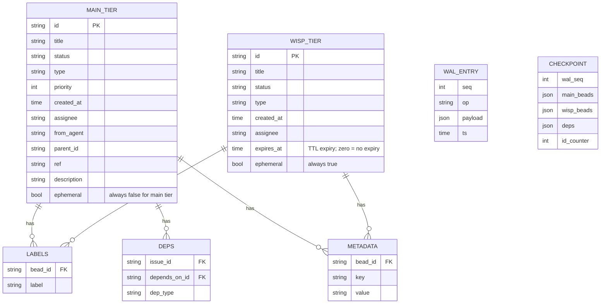

# R2.2 — Author-Our-Own HQ Coordination Store: Design, Build Cost, and Risk

> **Spike:** ga-aec8q.9  
> **Date:** 2026-05-22  
> **Author:** gascity/architect  
> **Scope:** HQ-only (gascity city DB). Rig DB is a separate, deferred problem.  
> **Basis:** discovery.md requirements (18 FRs, targets), existing codebase survey.

---

## Executive summary

A thin custom store satisfying all 18 FRs is **achievable from within the existing codebase** — the `beads.Store` interface, `MemStore`, and `FileStore` are already 60–70% of what is needed. The missing pieces are: (1) WAL durability replacing the full-JSON-rewrite persistence model, (2) in-memory secondary indexes replacing the current O(N) linear filter scan, (3) explicit two-tier separation with TTL sweeper. Estimated build cost is **~9 engineering-days / ~1,600 new production LOC** to satisfy all 18 FRs at the discovery targets. The principal risk is owning crash-recovery correctness; SQLite gets that for free.

---

## Existing building blocks

The codebase already contains three in-process Store implementations that provide direct reuse:

| Component | LOC | Provides |
|---|---:|---|
| `internal/beads/beads.go` — `Store` interface | 284 | Complete 22-method interface; FR-1–FR-18 specification |
| `internal/beads/memstore.go` — `MemStore` | 469 | Full in-memory CRUD + dep graph + filter scan (O(N), mutex-protected) |
| `internal/beads/filestore.go` — `FileStore` | 558 | MemStore + atomic JSON persistence (full rewrite per write) |
| `internal/beads/query.go` — `ListQuery`, `ApplyListQuery` | 222 | Filter spec, in-memory matcher (reusable as reference) |

**What MemStore/FileStore already satisfy:** FR-1 (CRUD by ID), FR-3 (point read), FR-4 (batch fetch), FR-5 (SetMetadataBatch atomically), FR-6 (read-after-write), FR-7 (two-tier flag present), FR-9 (Ready semantics via ApplyListQuery), FR-10 (dep graph), FR-11 (metadata map), FR-16 (zero-fork, in-process), FR-17 (FK on delete via linear sweep), FR-18 (range scan by recency via sort).

**What they do NOT satisfy:** FR-2 (indexed filter scan, O(1) not O(N)), FR-8 (indexed filter on ephemeral tier — the mail-poll hot path), FR-12 (TTL sweep on ephemeral tier), FR-15 (restart recovery ≤5s at 10k rows — FileStore full-JSON-rewrite is too slow at scale, and stale-file detection has a window), and the durability model is fragile (full rewrite = SIGKILL between write and rename = stale snapshot).

---

## Design: HQStore

### Architecture overview



### Data layout



### IndexedMemCore

The core is a mutex-protected in-memory store with secondary indexes maintained on every write. Both tiers (main, wisps) have their own index sets — enabling FR-8 (indexed filter on ephemeral tier) without cross-tier interference.

**Primary index:**
```
map[string]*Bead  (by ID, pointer to avoid copying on reads)
```

**Secondary indexes (maintained per tier):**
```
labelIdx    map[string]map[string]struct{}  // label → set of bead IDs
assigneeIdx map[string]map[string]struct{}  // assignee → set of bead IDs
statusIdx   map[string]map[string]struct{}  // status → set of bead IDs
typeIdx     map[string]map[string]struct{}  // type → set of bead IDs
parentIdx   map[string]map[string]struct{}  // parentID → set of bead IDs
metaIdx     map[string]map[string]map[string]struct{} // key → value → set of bead IDs
```

**Filter scan algorithm (FR-2, FR-8):**
1. Identify the most selective predicate from the query (typically assignee or label).
2. Start with that index's set.
3. Intersect remaining predicates by iterating the candidate set (not the full store).
4. For a query with assignee="gascity/builder" (typically ~5–20 beads), the scan is O(result_set), not O(N_total).

**Ready-set maintenance (FR-9):**
```
openUnblocked map[string]struct{}  // maintained incrementally
```
Invariant: `openUnblocked` contains exactly the IDs of beads where `status ∈ {open, in_progress}` AND no unresolved blocking deps exist AND `!IsReadyExcludedType(type)`. Updated on every Create, Update(status), Close, DepAdd, DepRemove. Ready() returns intersection of `openUnblocked` with query filters — no scan needed.

**SetMetadataBatch (FR-5, intra-record multi-key atomic):**
Single mutex lock, update all metadata keys in memory, emit one WAL entry with `op: "set_metadata", kvs: {...}`. Lock released after WAL write. Observers who read while the WAL write is in-flight see the pre-batch state (read lock excludes concurrent reads during the write lock window).

### WALWriter

Write-ahead log format (JSONL, one entry per line):

```
{"seq":1,"op":"create","tier":"main","bead":{...},"ts":"..."}
{"seq":2,"op":"update","tier":"main","id":"gc-xxx","opts":{...},"ts":"..."}
{"seq":3,"op":"close","tier":"main","id":"gc-xxx","ts":"..."}
{"seq":4,"op":"delete","tier":"main","id":"gc-xxx","ts":"..."}
{"seq":5,"op":"set_metadata","tier":"main","id":"gc-xxx","kvs":{...},"ts":"..."}
{"seq":6,"op":"dep_add","issue_id":"...","depends_on_id":"...","type":"...","ts":"..."}
{"seq":7,"op":"dep_remove","issue_id":"...","depends_on_id":"...","ts":"..."}
{"seq":8,"op":"create","tier":"wisp","bead":{...},"expires_at":"...","ts":"..."}
{"checkpoint_seq":1000,"ts":"..."}  ← checkpoint sentinel
```

**Durability guarantee:**
- Every write appends to `wal.jsonl` and calls `fsync` before returning to the caller.
- A SIGKILL between `write` and `fsync` yields a partial final line, which the recovery parser skips (partial lines are detected by lack of newline terminator).
- A SIGKILL between the in-memory update and the WAL write is prevented by holding the write lock through WAL flush — callers see the old state until the WAL entry lands.

**Checkpointing:**
- Every 1,000 WAL entries (or on clean shutdown), write `checkpoint.json` containing a full snapshot of both tiers plus the WAL seq number.
- On recovery: load checkpoint → replay WAL entries with seq > checkpoint_seq → rebuild indexes.
- Checkpoint is written atomically (temp file + rename).

**Recovery time estimate:**
- 10k open records × ~200 bytes JSON = ~2 MB checkpoint → read: <10ms
- 1,000 WAL entries to replay (max since last checkpoint): ~5ms
- Index rebuild for 10k records: ~50ms
- **Total: well under 5s target (FR-15).**

### TTLSweeper

A goroutine launched by HQStore.Open(), runs every 60 seconds:
1. Lock wisps tier read-mutex.
2. Collect all IDs where `expires_at` is set and `expires_at < now`.
3. Release read lock.
4. For each expired ID: call Delete (which handles index cleanup + WAL entry).

The sweeper does not hold the write lock during the collection phase. Each Delete is individually locked and WAL-appended. Expired wisps that haven't been swept yet are excluded from List queries by the filter logic (`expires_at.IsZero() || !b.ExpiresAt.Before(now)`).

### File layout

```
.gc/store/
├── wal.jsonl          ← append-only WAL (never truncated except at compact)
├── checkpoint.json    ← periodic snapshot (latest only)
└── checkpoint.json.tmp ← in-progress checkpoint write (atomic rename on complete)
```

---

## FR coverage matrix

| FR | Requirement | Author-own | Notes |
|---|---|---|---|
| FR-1 | CRUD by stable string ID | ✅ | IndexedMemCore primary map |
| FR-2 | Indexed filter scan ≤10ms | ✅ | Secondary indexes; O(result_set) |
| FR-3 | Point read ≤1ms | ✅ | O(1) map lookup |
| FR-4 | Batch-by-id-set ≤5ms | ✅ | Loop over ID set in primary map |
| FR-5 | Intra-record multi-key atomic write | ✅ | Single WAL entry under write lock |
| FR-6 | Read-after-write within process | ✅ | In-process; lock serializes |
| FR-7 | Two-tier (main + wisps, same API) | ✅ | Separate index sets, routed by Ephemeral flag |
| FR-8 | Indexed filter on ephemeral tier ≤10ms | ✅ | Wisp tier has its own secondary indexes |
| FR-9 | Ready semantics (unblocked open) | ✅ | openUnblocked set, incrementally maintained |
| FR-10 | Dependency graph (add/remove/list) | ✅ | Dep slice + depIdx maps |
| FR-11 | Per-record metadata, filterable | ✅ | metaIdx for O(1) filter |
| FR-12 | TTL-based expiry + bulk sweep | ✅ | TTLSweeper goroutine, 60s cadence |
| FR-13 | Append-only event log (O_APPEND) | ✅ | events.jsonl unchanged; not a store concern |
| FR-14 | Advisory locks (kernel flock) | ✅ | Unchanged; not a store concern |
| FR-15 | Background prime ≤5s at 10k rows | ✅ | Checkpoint load + index rebuild <100ms |
| FR-16 | Zero-fork in-process access | ✅ | Core design; no subprocess |
| FR-17 | Label/event FK integrity on delete | ✅ | Delete cleans all index entries for bead |
| FR-18 | Range scan by recency (created_at DESC) | ✅ | createdAtIdx or sort-on-scan (≤10ms at 10k) |

---

## Build cost estimate

### Reused without change

| Component | LOC | Notes |
|---|---:|---|
| `beads.Store` interface | 284 | Zero change |
| `beads.Bead`, `UpdateOpts`, `Dep`, `ListQuery` types | ~150 | Zero change |
| `beads.ApplyListQuery` + `Matches` logic | 222 | Reference; new index-based path replaces it |

### New production code

| File | LOC est. | Content |
|---|---:|---|
| `internal/beads/hqstore.go` | ~180 | HQStore type, Open/Close, goroutine lifecycle, config |
| `internal/beads/hqstore_core.go` | ~650 | IndexedMemCore: primary map, 6 secondary index types, two-tier routing, all 22 Store methods |
| `internal/beads/hqstore_wal.go` | ~420 | WALWriter: JSONL append, fsync, seq counter, entry types, partial-line recovery, replay |
| `internal/beads/hqstore_checkpoint.go` | ~200 | Checkpoint write/load, atomic rename, recovery orchestration |
| `internal/beads/hqstore_ttl.go` | ~130 | TTLSweeper goroutine, cadence, expiry enforcement |
| **Total new production code** | **~1,580** | |

### New test code

| File | LOC est. | Content |
|---|---:|---|
| `internal/beads/hqstore_test.go` | ~700 | Store interface compliance (reuse existing MemStore test suite), FR-targeted tests |
| `internal/beads/hqstore_wal_test.go` | ~350 | WAL replay, partial-line recovery, fsync failure injection |
| `internal/beads/hqstore_checkpoint_test.go` | ~200 | Checkpoint round-trip, atomic rename under concurrent writes |
| `internal/beads/hqstore_ttl_test.go` | ~150 | TTL expiry, sweeper cadence, expiry during active reads |
| **Total new test code** | **~1,400** | |

### Engineering time

| Phase | Work | Days |
|---|---|---:|
| 1 | Core IndexedMemCore: primary + secondary indexes, all 22 Store methods, Store interface compliance tests | 3 |
| 2 | WAL: format, writer, fsync, replay, partial-line parser, checkpoint | 2 |
| 3 | Recovery: orchestration (load checkpoint + replay WAL + rebuild indexes), recovery test suite | 1 |
| 4 | Two-tier separation + TTL sweeper + TTL tests | 1 |
| 5 | Integration wiring: HQStore as gc exec provider, gc start/stop lifecycle, smoke tests | 1 |
| 6 | Stress testing against discovery.md targets (latency, throughput, memory under 10k rows) | 1 |
| **Total** | | **9 days** |

R2.1's PoC benchmark (in-process SQLite vs thin author-store PoC) will validate or challenge the latency estimates; these numbers assume the author-store architecture described above.

---

## Maintenance burden

### What we own permanently

| Concern | Ownership |
|---|---|
| WAL format evolution | Every schema change requires a WAL version bump and migration reader |
| Crash recovery correctness | Our code; our bugs; our on-call risk |
| Index consistency invariants | Every new write path must maintain all 6 index types |
| Checkpoint compaction | If WAL grows unbounded between restarts, recovery slows |
| Concurrency correctness | sync.RWMutex + lock ordering; deadlock detection is manual |
| TTL boundary correctness | Expiry at-exactly-TTL is subtle; off-by-one = data loss or phantom entries |
| Memory leak prevention | Index entries for deleted beads must be cleaned up on every delete path |

### Steady-state maintenance estimate

| Horizon | Effort |
|---|---|
| First 3 months (stabilize) | ~3 days/month (bug fixes, corner cases found in production) |
| Ongoing (steady-state) | ~1 day/month (minor improvements, new field types, retention policy changes) |
| Major evolution (e.g., new index type, WAL format v2) | ~3–5 days/event, ~1 event/year |
| **Annual total** | **~15–20 days/year** |

Compare: SQLite maintenance burden is ~0 days/year for the storage layer itself. Our only SQLite maintenance would be schema changes (DDL migrations), which are ~1-2 days/year at this scale.

---

## What we own vs. what SQLite provides

| Concern | Author-own | SQLite (adopt) |
|---|---|---|
| Crash recovery | We write it, test it, own it | SQLite WAL handles it; proven at scale |
| Index consistency | We maintain all 6 index types on every write path | B-tree maintained by SQLite engine |
| Concurrent access | sync.RWMutex + WAL ordering | SQLite WAL mode handles concurrency |
| Query planner | Fixed index-intersection logic, manual | SQLite query planner, EXPLAIN available |
| Data format upgrade | WAL version + replay migration | ALTER TABLE / migration scripts |
| Community | Zero community; all bugs are ours | Millions of deployments; bugs surface fast |
| Performance optimizations | All ours to discover | Community continuously improves |
| Test coverage | ~1,400 LOC new tests | SQLite is tested by millions |
| Security patches | Ours to backport (e.g., WAL parsing edge cases) | Upstream releases CVE patches |
| Operational tooling | None; custom introspection commands | `sqlite3` CLI, DB Browser for SQLite |
| Alignment with Go idioms | Native Go; no CGo | `modernc.org/sqlite` (pure Go) or `mattn/go-sqlite3` (CGo) |
| Binary size | ~1,600 LOC ≈ no change in binary size | +~3MB (SQLite embedded) |

---

## Risk table

| Risk | Likelihood | Impact | Mitigation |
|---|---|---|---|
| WAL corruption on SIGKILL mid-fsync | Low (fsync semantics on Linux are well-specified) | High (partial WAL entry on replay) | Partial-line detection (no newline terminator = skip); WAL entry CRC-32 check |
| Index consistency bug (missed cleanup on delete) | Medium (6 index types × 4 write paths) | Medium (stale IDs in index → spurious results) | Comprehensive test suite; assert-on-read index integrity check in debug builds |
| Ready-set stale (openUnblocked drift) | Medium (dep-graph changes must update set atomically) | High (wrong work returned by Ready()) | Ready() cross-checks against full scan in test mode; invariant test |
| Memory growth from index tombstones | Low (Delete cleans all indexes) | Medium (memory leak over months) | Periodic index-compaction pass in TTLSweeper; memory profiling in CI |
| Checkpoint compaction failure (disk full mid-write) | Low | High (recovery falls back to full WAL replay) | Atomic checkpoint write (temp + rename); WAL is still valid; recovery degrades gracefully |
| WAL format version incompatibility after gc upgrade | Medium (format will evolve) | Medium (gc won't start until migration runs) | WAL format version header on line 1; migration reader for v→v+1 |
| TTL boundary race (expiry during active read) | Low (sweeper holds write lock during Delete) | Low (bead may appear in results then vanish) | Callers already handle bead-not-found on follow-up Get |
| Underperformance vs. targets (author-store PoC benchmark) | Unknown until R2.1 lands | High (kills adopt-or-author decision) | R2.1 PoC benchmark will measure; if WAL fsync dominates, switch to sync=normal or batch-fsync |

---

## Trade-offs and alternatives considered

### Alternative A: Extend FileStore directly

FileStore already provides JSON persistence. The obvious cheapest path: add secondary indexes to FileStore without WAL.

**Why rejected:** Full-JSON-rewrite on every write is O(N) in store size. At 25k beads (today's volume), a single Create() rewrites ~50MB of JSON. More critically, full-rewrite has a SIGKILL window between the temp write and the atomic rename — data loss risk grows with file size. This approach does not satisfy FR-15 at scale.

### Alternative B: BoltDB / bbolt embedded

bbolt is a pure Go B-tree KV store with ACID transactions. It would satisfy FR-1 through FR-6, FR-10, FR-16, FR-18. It does NOT natively satisfy FR-2/FR-8 (no secondary indexes — those are application-layer), FR-7/FR-12 (two-tier + TTL must be built atop the KV API), or FR-9 (ready semantics are application-layer).

**Net result:** we'd build roughly the same IndexedMemCore on top of bbolt's persistence, adding bbolt as a dependency. The maintenance burden is similar (we own the index layer), but we get crash recovery from bbolt. This is a legitimate middle path — see R2.1 FR capability matrix for the detailed comparison.

### Alternative C: SQLite in-process

The adopt path. SQLite provides crash recovery, indexes, and TTL (via DELETE WHERE) natively. FR-2 and FR-8 are just CREATE INDEX. FR-7 (two-tier) is two SQL tables. FR-5 (SetMetadataBatch) is one UPDATE within a transaction. The author-own path above builds the equivalent of what SQLite already provides.

**The core trade-off:** SQLite's storage layer is more robust and more tested than our WAL. We pay: CGo dependency (or pure-Go SQLite's slower performance), SQL schema migration complexity, and loss of the current flexible Bead struct as the canonical in-memory representation. We gain: zero crash-recovery ownership, proven index correctness, operational tooling. See R2.1 benchmark for performance numbers.

---

## Recommendation framing for R2.4

The author-own path is **technically viable** at ~9 days / ~1,580 LOC. The two reasons to prefer it over SQLite:

1. **No CGo / pure-Go binary.** The gc binary currently has zero C dependencies. Embedding SQLite via `mattn/go-sqlite3` breaks that (CGo required); `modernc.org/sqlite` is pure-Go but is ~3x slower than the C version.
2. **Bead struct stays canonical.** The current in-memory `Bead` type is shared across store implementations and the entire controller. With SQLite, every read/write path gains a SQL↔Bead marshal/unmarshal layer.

The two reasons to prefer SQLite:

1. **Crash recovery is proven.** We do not write or own the WAL fsync correctness. This is load-bearing at 2am during a city crash.
2. **Index correctness is proven.** We do not debug the "stale IDs in assignee index after delete" class of bugs.

The R2.1 benchmark results will determine whether the performance gap between author-own and SQLite is material at the discovery.md targets. If the author-store PoC meets all latency targets in R2.1, the author-own path is a strong candidate. If it doesn't — or if the WAL implementation proves more complex than estimated — SQLite is the lower-risk default.

---

*Next: R2.3 (migration path), R2.4 (synthesis)*
