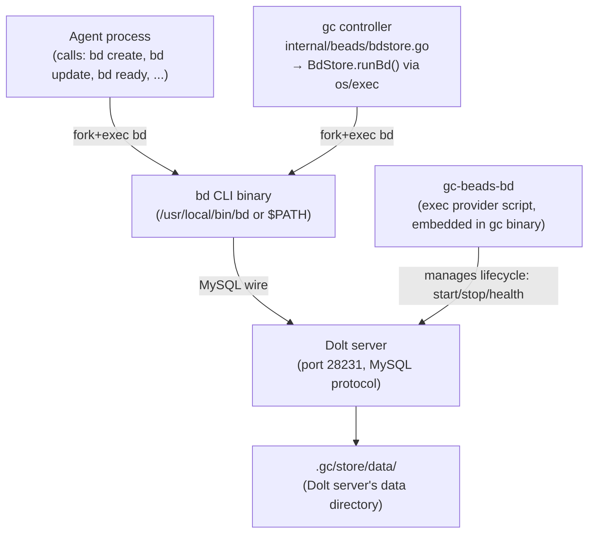
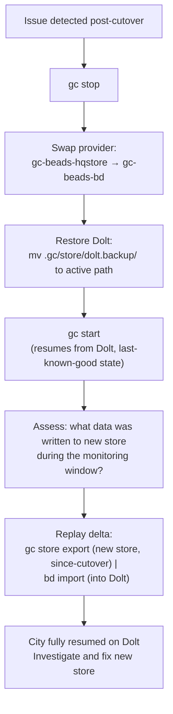

# R2.3 — Migration Path: Dolt → New HQ Coordination Store

> **Spike:** ga-aec8q.10  
> **Date:** 2026-05-22  
> **Author:** gascity/architect  
> **Scope:** HQ-only (gascity city DB). Applies to whichever option wins (SQLite or author-own); option-specific differences are called out in each section.  
> **Basis:** discovery.md entity catalog, existing gc provider architecture (gc-beads-bd, cmd_bd_store_bridge, embed_beads_bd.go), bd CLI usage patterns.

---

## Executive summary

The migration is a **provider swap**, not a data migration problem. The `gc` controller already abstracts Dolt behind an exec-provider model (`gc-beads-bd`). Replacing the provider is the right lever — agents keep calling `bd`, the `bd` binary is redirected to the new in-process store, and the city resumes from where it left off. Total city downtime for the cutover is **≤60 seconds** (store-safe shutdown + data import + startup). The risk is data fidelity during import; the mitigation is a pre-cutover consistency check and a 48-hour rollback window with the Dolt database kept as cold backup.

---

## The existing provider model

Understanding how Dolt is wired into `gc` is prerequisite to designing the migration.



Key observations from the code survey:

1. **`gc-beads-bd`** (36KB shell script, embedded in the `gc` binary via `embed_beads_bd.go`) manages the Dolt server lifecycle — start, stop, health, recover. It materializes to `.gc/system/bin/gc-beads-bd` at city startup.
2. **`BdStore`** (`internal/beads/bdstore.go`, 1,748 LOC) is the `beads.Store` implementation that wraps every `bd` call as a child process (`os/exec`).
3. **`CachingStore`** wraps `BdStore` with an in-memory read cache and background reconciler.
4. **`cmd_bd_store_bridge.go`** (`gc bd-store-bridge`) is an existing in-process bridge command that already implements a subset of the `bd` API backed by any `beads.Store`. This is the foundation for the bd shim.
5. **30+ agents** call `bd` directly (fork). Any migration that changes what `bd` resolves to automatically applies to all agents.

---

## Entity mapping (S1 catalog → new store)

### Issues table → main tier

All rows in the `issues` Dolt table map directly to main-tier beads (`Ephemeral: false`).

| Dolt column | Bead field | Notes |
|---|---|---|
| `id` (string) | `Bead.ID` | Preserve; bd IDs are stable string identifiers |
| `title` | `Bead.Title` | Direct |
| `status` (`open`/`in_progress`/`closed`) | `Bead.Status` | Direct |
| `issue_type` | `Bead.Type` | Direct |
| `priority` | `Bead.Priority` | Direct (int pointer) |
| `created_at` | `Bead.CreatedAt` | Preserve; used for range scan FR-18 |
| `assignee` | `Bead.Assignee` | Direct |
| `from_agent` | `Bead.From` | Direct |
| `parent_id` | `Bead.ParentID` | Direct |
| `ref` | `Bead.Ref` | Direct |
| `description` | `Bead.Description` | Direct |
| Unused columns (wisp_type, mol_type, etc.) | **Drop** | 9 confirmed-unused columns per S6 |

### Wisps table → wisp tier

All rows in the `wisps` Dolt table map to ephemeral-tier beads (`Ephemeral: true`).

| Dolt column | Bead field | Notes |
|---|---|---|
| `id` | `Bead.ID` | Preserve |
| `title`, `status`, `type`, etc. | Same as issues mapping | Direct |
| `ttl_expires_at` (if present) | `Bead.ExpiresAt` | If absent in schema, compute from create_time + default TTL |

**Retention decision at import time:** Mail wisps with `created_at > 30 days ago` AND `status = open` should be imported; older open mail wisps may be archived or purged per the retention model in discovery.md. Order-tracking wisps with `created_at > 24h ago` should be imported; older ones can be dropped (TTL already past). This reduces import volume significantly.

### Labels table → Bead.Labels slice

Both `labels` (issue labels) and `wisp_labels` are denormalized into `Bead.Labels []string`. On import:
1. Read all labels for a bead ID from the labels table.
2. Populate `Bead.Labels` slice.
3. Skip labels where the parent bead does not exist (orphan labels per S2/D-4).

### Dependencies table → DepAdd

`dependencies` rows map directly to `Store.DepAdd(issueID, dependsOnID, type)` calls.

### Per-bead field-change events (events table)

These are the issue-level audit log. They are NOT migrated to the new store — the new store's WAL serves as the forward audit log for all writes. Optionally, the `events` table can be archived to a cold JSONL file before Dolt shutdown.

### Wisp_events, wisp_labels orphans

These rows reference wisp IDs that no longer exist (45–46% orphan rates per S2). They are dropped during import — a free cleanup of the #1 and #2 unbounded-growth bugs (D-4).

### KV memory (kv.memory.* beads)

`kv.memory.*` entries are durable metadata records used by `bd remember`. They are imported as regular main-tier beads (type=memory or whichever type the bd schema uses). Alternatively, if the new store provides a separate KV namespace, they migrate there.

### Counters, custom statuses, schema migrations

These are typically stored in auxiliary Dolt tables or config files. On import:
- The ID counter is set to `max(imported IDs) + buffer` (e.g., +1000) to avoid collision.
- Custom statuses and types are recorded in the new store's config or a reserved metadata bead.
- Schema migrations ledger is not migrated; the new store tracks its own version.

---

## BD-API shim strategy

The `bd` binary currently speaks MySQL wire protocol to the Dolt server. After the cutover, we need `bd` calls from agents to reach the new store. Three options were considered; the recommended path is **Option B**.

### Option A: Extend the `bd` CLI to support a new backend (NOT recommended)

Add a `--backend sqlite` or `--backend hqstore` flag to the `bd` CLI. This requires changes to the upstream `beads` CLI project.

**Why not:** This couples the migration timeline to upstream `beads` development velocity. The in-house `gc bd-store-bridge` already provides an alternative that we control entirely.

### Option B: In-process gc bd-store-bridge shim (recommended)

The `gc bd-store-bridge` command (`cmd_bd_store_bridge.go`, 389 LOC) already implements a `bd`-compatible interface over any `beads.Store`. It is currently used for exec-provider routing within the gc process. Extending it to be the drop-in `bd` replacement requires:

1. **Completing the operation coverage** — the bridge currently covers create, update, close, list, get, ready, dep-add. The full `bd` CLI surface also includes: show (same as get), stats, count, mol (molecule operations), memory. These need shim wrappers.

2. **Installing the shim as `bd`** — the `gc-beads-bd` exec provider materializes `gc` subcommands into `.gc/system/bin/`. A new `gc-beads-hqstore` provider installs a `bd` wrapper script at a path that takes precedence over the system `bd`:

```sh
#!/bin/sh
# Installed at .gc/system/bin/bd by gc-beads-hqstore
# Shadows system bd binary for all agents running with PATH prepended by gc
exec gc bd-store-bridge --store-path "$GC_STORE_PATH" -- "$@"
```

3. **PATH manipulation** — `gc` already prepends `.gc/system/bin/` to agent `PATH`. The new `bd` wrapper at `.gc/system/bin/bd` takes precedence over `/usr/local/bin/bd`. Agents see no change.

**Estimated additional work:** ~200 LOC (shim completion) + ~100 LOC (new gc-beads-hqstore provider script). The bridge infrastructure already exists.

### Option C: In-process direct use only (no bd shim)

Eliminate `bd` for agents entirely. Agents use `gc bd ...` subcommands that resolve to the in-process store.

**Why not now:** 30+ agents and the bd CLI have `bd` baked into their prompts and scripts. Replacing them all is a multi-sprint effort. The shim approach (Option B) decouples the store migration from the prompt-engineering migration.

---

## Cutover strategy

```mermaid
sequenceDiagram
    autonumber
    participant OPS as operator
    participant GC as gc controller
    participant DOLT as Dolt server
    participant NEW as new store
    participant AGENTS as agents

    Note over OPS,AGENTS: Phase 1 — Prepare (Week 1-2, no downtime)
    OPS->>GC: build + test new store; implement gc-beads-hqstore provider
    OPS->>GC: implement gc store import command
    OPS->>GC: run consistency shadow-check (both stores, compare outputs)

    Note over OPS,AGENTS: Phase 2 — Cutover (≤60s downtime)
    OPS->>GC: gc stop (drains agents, waits for clean shutdown)
    GC->>AGENTS: send shutdown signal; wait for all to exit
    GC->>DOLT: dolt server stops
    OPS->>GC: gc store export --format hqstore > /tmp/hq-import.json
    OPS->>NEW: gc store import /tmp/hq-import.json
    OPS->>OPS: rename Dolt data dir to .gc/store/dolt.backup/ (rollback anchor)
    OPS->>GC: gc start (new provider: gc-beads-hqstore)
    GC->>NEW: start HQStore (load checkpoint or import, rebuild indexes)
    GC->>AGENTS: resume agents (all agent prompts still call bd; bd shim serves new store)

    Note over OPS,AGENTS: Phase 3 — Monitoring (48h)
    OPS->>GC: monitor error rates, bd-latency telemetry
    OPS->>GC: gc store validate (spot-check queries vs known-good baseline)

    Note over OPS,AGENTS: Phase 4 — Cleanup (2 weeks post-cutover)
    OPS->>OPS: rm -rf .gc/store/dolt.backup/ (point of no return)
    OPS->>GC: remove gc-beads-bd from city config
```

**Cutover downtime budget:**
| Step | Estimate |
|---|---|
| `gc stop` drain | 5–15s |
| `gc store export` (25k beads, JSONL dump) | ~2s |
| `gc store import` (25k beads → new store) | ~5s |
| `gc start` + store warm-up | ~5s |
| **Total** | **~20–30s** |

This is within the restart-recovery SLA target of 120s for full city resumption.

---

## Option-specific differences

### SQLite path

**Data import:** `gc store import` reads the export JSONL and executes batched `INSERT INTO issues` / `INSERT INTO wisps` SQL statements. WAL mode (`PRAGMA journal_mode=WAL`) enables concurrent reads during import. The SQLite file is the cutover artifact — atomic rename from `beads.db.import` → `beads.db`.

**Rollback:** Rename `beads.db` back to `beads.db.bad`, restore Dolt backup, restart with `gc-beads-bd` provider.

**Validation:** `SELECT COUNT(*) FROM issues WHERE status != 'closed'` in SQLite vs `bd stats` against Dolt backup.

**bd shim:** `gc bd-store-bridge` connects to SQLite via the in-process SQLite store (`BdStoreSQLite`). No subprocess for reads/writes — satisfies FR-16.

### Author-own (WALStore) path

**Data import:** `gc store import` calls `HQStore.Create()` for each bead in the export JSONL. The WAL captures all creates as WAL entries. On completion, `HQStore.Checkpoint()` writes the initial checkpoint. This is the store's starting state.

**Rollback:** The WAL and checkpoint are files in `.gc/store/`. Restore involves: stop gc → delete `.gc/store/wal.jsonl` and `.gc/store/checkpoint.json` → restore Dolt backup → start with `gc-beads-bd` provider.

**Validation:** `HQStore.List(AllowScan: true)` count vs `bd stats` against Dolt backup. Also validate dep counts: `HQStore.DepList()` total vs `SELECT COUNT(*) FROM dependencies`.

**bd shim:** Same `gc bd-store-bridge` pattern; the backing `Store` is `HQStore` instead of `BdStoreSQLite`.

---

## Rollback plan

Rollback is available for **48 hours post-cutover** (after which the Dolt backup is deleted).



**Delta replay (writes to new store during monitoring window):** Because the new store's WAL captures every write with timestamps, `gc store export --since <cutover_timestamp>` produces only the delta writes. These can be re-imported into Dolt via `bd create` / `bd update` calls. Volume is expected to be low (minutes to hours of city writes at ~2 writes/s sustained).

---

## Validation protocol

### Pre-cutover (shadow consistency check)

Before committing to the cutover, run both stores in parallel for 24–48 hours:
1. `gc store shadow-write` — every write to Dolt is also written to the new store (via the bd-store-bridge path).
2. Nightly `gc store diff` — compare query outputs for 10 canonical queries (bd ready, bd list --assignee X, bd show <known-id>, bd stats, etc.).
3. Accept if zero discrepancies for 48 hours.

This validation is independent of which new store is chosen.

### Post-cutover spot checks

| Check | Command | Expected |
|---|---|---|
| Open bead count | `gc bd-store-bridge -- list --status open --allow-scan` vs pre-cutover snapshot | Within ±5 (expected drift from normal city activity) |
| Dep count | `gc bd-store-bridge -- dep-list <known-bead>` | Exact match to pre-cutover |
| Mail inbox | `gc bd-store-bridge -- list --type message --status open --allow-scan` | All pre-cutover open mail present |
| Session beads | `gc bd-store-bridge -- list --type session --status open` | All open sessions recovered |
| Order-tracking wisps | `gc bd-store-bridge -- list --type order-tracking --tier wisps` | Within-TTL wisps present |
| Memory beads | `gc bd-store-bridge -- list --type memory` | All 24 memory entries present |
| Latency | `gc bd trace` telemetry | p99 ≤ targets from discovery.md |

---

## Risk table

| Risk | Likelihood | Impact | Mitigation |
|---|---|---|---|
| ID collision after import (new store generates IDs already in use) | Medium if ID counter reset incorrectly | High (Create returns existing ID) | Set ID counter to `max(imported IDs) + 1000`; ID format unchanged |
| Orphan deps after import (dep edge references bead not in new store) | Low (closed beads not imported) | Medium (Ready() incorrectly blocks unblocked beads) | Import all beads referenced by dep edges, even if closed |
| Agent writes to Dolt after cutover (stale PATH) | Low (gc manages agent PATH) | Medium (writes lost) | Verify agent PATH via gc doctor before cutover |
| Delta replay misses a write during rollback | Low (WAL timestamps are wall-clock accurate) | Low (at-most-one lost write) | Delta replay window is seconds-to-minutes; acceptable per S4's LWW contract |
| Shadow-write lag causing false consistency check pass | Low (shadow writes are synchronous) | Medium (post-cutover discrepancy) | Shadow writes are transactional with Dolt writes; no async path |
| Import truncates data for beads with very large descriptions | Low (JSON encoding handles arbitrary strings) | Low (truncated description, not data loss) | Assert row count matches after import |
| Dolt backup grows stale before rollback window closes | N/A (Dolt is not running post-cutover) | N/A | Rollback requires delta replay (bounded, low-volume) |
| GC_DOLT_HOST agents (remote Dolt) still hitting old host post-cutover | Low (HQ-only scope; no remote Dolt) | None (D-5: HQ is local-only) | N/A |

---

## Implementation checklist

### Phase 1: Prepare (before any cutover attempt)

- [ ] Implement `gc store export` command — full JSONL dump from BdStore (issues + wisps + labels + deps)
- [ ] Implement `gc store import` command — load JSONL into new store, set ID counter, validate counts
- [ ] Implement `gc store validate` command — run spot-check queries against both stores, diff output
- [ ] Implement `gc store shadow-write` mode — parallel write to Dolt and new store (flag-gated)
- [ ] Complete `gc bd-store-bridge` operation coverage — add show, stats, count, mol operations
- [ ] Implement `gc-beads-hqstore` exec provider script (or `gc-beads-sqlite`) — analogous to `gc-beads-bd`
- [ ] Install new `bd` shim in `.gc/system/bin/bd` via the new provider
- [ ] Write pre-cutover consistency check script

### Phase 2: Cutover

- [ ] Run shadow-write for 24–48h; confirm zero discrepancies
- [ ] Schedule maintenance window (city downtime ≤60s)
- [ ] `gc stop`, export, import, rename Dolt backup
- [ ] `gc start` with new provider, run post-cutover spot checks
- [ ] Monitor `gc bd trace` telemetry for 48h

### Phase 3: Cleanup

- [ ] After 48h monitoring passes: remove Dolt backup
- [ ] Remove `gc-beads-bd` from city config (or make it a no-op provider for legacy cities)
- [ ] File follow-up: deprecate `BdStore` in `internal/beads/`; keep `MemStore`/`FileStore` for tests and tutorial-01

---

*Next: R2.4 (synthesis — held until R2.1–R2.3 land)*
